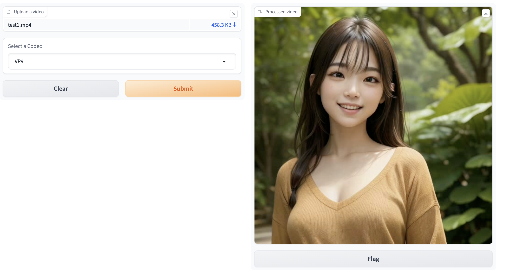

# smooth-frames-web-ui

Web UI tool for smoothing videos using [RIFE ncnn Vulkan](https://github.com/nihui/rife-ncnn-vulkan).

## Demo

### Input video

https://github.com/shinshin86/smooth-frames-web-ui/assets/8216064/69aee72c-bff7-434f-b462-71afe108b524

### Output video

https://github.com/shinshin86/smooth-frames-web-ui/assets/8216064/05a8abe9-8abe-46a3-b716-38d8e4a1d56b

## Usage

First you need to install [RIFE ncnn Vulkan](https://github.com/nihui/rife-ncnn-vulkan) in your environment.  
Release binaries for each OS are available in [GitHub releases](https://github.com/nihui/rife-ncnn-vulkan/releases), so please download them.

Next, put the path to RIFE ncnn Vulkan in your `.env` file.

Copy the `.env_sample` with the name `.env`.
Then specify the path.

```
cp .env_sample .env
```

Example setting `.env`:

```
RIFE_NCNN_VULKAN_PATH =./rife-ncnn-vulkan/rife-ncnn-vulkan
```

Then install the Python dependencies.  
This project uses [rye](https://github.com/mitsuhiko/rye).

```
rye sync
```

Finally, run the following command to launch Gradio's Web UI.

```
python launch.py
```

Access to `localhost:7860`.



### About codecs

On the Web UI, previews can only be displayed in webm format (with the codecs currently available for selection).  
Therefore, the default is to export files in webm (VP9 codec).  
However, mp4 (MPEG4-V codec) has a smaller file size after conversion.  
You can change these codecs in the drop-down list.

## Google Colab

To use on Google Colab, execute the following command

```
!apt-get install -y libvulkan-dev

!git clone https://github.com/shinshin86/smooth-frames-web-ui.git
%cd smooth-frames-web-ui

!wget https://github.com/nihui/rife-ncnn-vulkan/releases/download/20221029/rife-ncnn-vulkan-20221029-ubuntu.zip
!unzip rife-ncnn-vulkan-20221029-ubuntu

!echo "RIFE_NCNN_VULKAN_PATH =./rife-ncnn-vulkan-20221029-ubuntu/rife-ncnn-vulkan" > .env

!pip install gradio python-dotenv

!python launch.py --share
```

## Special thanks

I came up with this program after learning about [RIFE ncnn Vulkan](https://github.com/nihui/rife-ncnn-vulkan).
